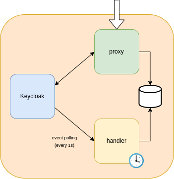

# Disclaimer - Work in progress

The repository you are looking into is work in progress.

It contains proof of concept and preview builds in development created in context of the [openDesk](https://gitlab.opencode.de/bmi/souveraener_arbeitsplatz/info) project.

The repository's content provides you with first insights into the containerized cloud IAM from Univention, derived from the UCS appliance.

# KeyCloak Extensions

## Introduction

This is the repository for Keycloak Extensions, currently being:

1. Brute-Force Protection
2. New Device Login

### Brute-Force Protection (BFP)

This extension aims to protect Keycloak from brute-force attacks.

> In cryptography, a brute-force attack consists of an attacker submitting many passwords or passphrases with the hope of eventually guessing correctly.

### New Device Login (NDL)

This extension aims to notify users by email when they login from a new device.

# Setup

## Configure Keycloak

### Events

We need user events to be enabled. In order to do so:

#### Keycloak > 18

1. Access `http://localhost:5050/admin`.
2. Click `Administration Console`.
3. Access with user `admin` and password `univention`.
4. Click `Realm settings` on the left menu.
5. Go to `Events` tab.
6. Under `User events settings` set `Save events` to `ON`.
7. You can set an expiration time for events, but it is not needed for local testing.
8. For now we only need `LOGIN_ERROR` and `LOGIN`, but no need to disable the other 111 event types.

#### Keycloak <= 18

1. Access `http://localhost:5050/admin`.
2. Click `Administration Console`.
3. Access with user `admin` and password `univention`.
4. Click `Events` on the left menu, towards the bottom.
5. Go into `Config` tab.
6. Under `Login Events Settings`, set `Save Events` to `ON`.
7. Save.
8. (Not needed) You can set an expiration time for events, but it is not needed for local testing.
9. (Not needed) For now we only need `LOGIN_ERROR` and `LOGIN`, but no need to disable the other 111 event types.

> Any changes to `docker-compose.yaml` will affect this steps.

### Configure reCaptcha

In order for reCaptcha to work, we need to tweak two things on Keycloak:

1. Go to `Realm settings > Security Defenses` and set:
2. `X-Frame-Options` to `ALLOW-FROM https://www.google.com`
3. `Content-Security-Policy` to `frame-src 'self' https://www.google.com; frame-ancestors 'self'; object-src 'none';`
4. Save.

Now you need to check that your proxy gets the environment variable `CAPTCHA_SITE_KEY`.
For localhost, I lend you this one: `6LcUyZkiAAAAAHo98CowhZFoc-E-3yeo38Hs1HSB`, but you
may want to grab one from [here](https://www.google.com/recaptcha/admin/).

Currently only Google reCaptcha is supported, but Cloudflare and others are easy to integrate.

## Development setup

A [`docker-compose.yaml`](./docker-compose.yaml) file is provided in the root folder of the repository to ease running the application locally. You can get the application running by:

`docker compose up -d keycloak database`
`docker compose up -d proxy handler`

> Notice the commands are separated, due to an entrypoint not existing to handle awaiting for containers to be ready.

You can access:

- Keycloak at `http://localhost:5050` (only for configuration).
- Proxied Keycloak at `http://localhost:8181` (protected by proxy).
- Handler will be polling Keycloak directly (without the proxy).

## Architecture

> You may find more documentation about each component inside `proxy` and `handler` folders.

## Future lines of work

1. Keycloak event monitoring on Grafana (sucessful logins, failed login attempts...)
2. UDM integration
3. Whitelists
4. Blacklists
